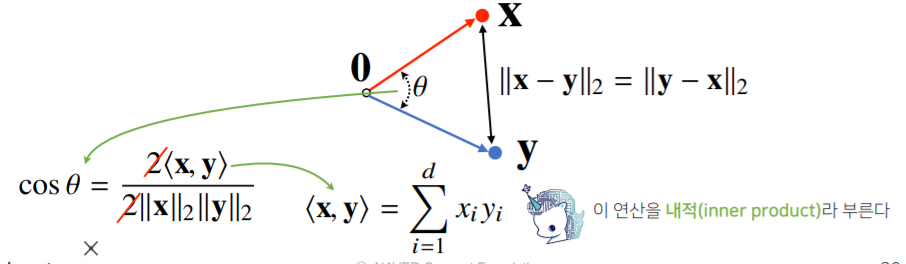
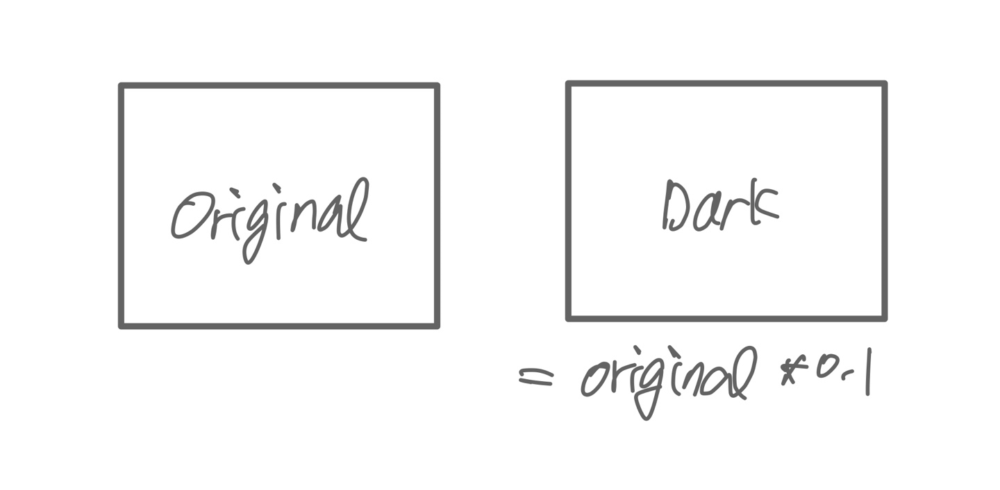

# 18.1.1. Geometry of Vectors [벡터]

- 정의 : 숫자를 원소로 가지는 리스트, 배열
- 1. 공간에서 **한 점**을 나타낸다
- 1. 백터는 **원점으로부터 상대적 위치**를 표현한다.

# 18.1.2. Dot Products and Angles [행렬곱과 각도]

두 벡터의 곱과 각은 매우 밀접하다.

[두 벡터 사이의 각도]

- L2 노름으로 계산 가능 (L1 은 불가능)



### 두 벡터 사이의 각도를 구하는 이유 [ML - Dive into Deep Learning]

밝기만 다른 두 이미지 있다고 가정해보자.



> 만약 두 이미지의 각 픽셀 차이만 본다면 두 이미지는 완전히 다른 이미지 일것이다. 하지만 Dark 는 Original에서 밝기만 0.1로 줄였을뿐 똑같은 이미지다. 이럴때 두 벡터의 각도를 구한다면 (origin) V와 (dark) 0.1V의 각도는 '0'으로 같은 방향의 벡터이지만 길이만 변했다는 것을 알 수 있다. 이것을 현업에 사용하기 위해 만든 것이 **코사인 유사도** 이다.  (위의 그림에 있는 cos 수식) 코사인 유사도를 활용해 두 벡터의 유사도를 따질 수 있고 그 값은 -1≤cos≤1사이이다. 따라서 Origin과 Dark는 동일한 이미지임을 밝혀낼 수 있다.

# 18.1.3. Hyperplanes [초평면]


위의 그림은 w의 벡터가 [2,1] 일때 v벡터의 정사영된 길이를 구할 수 있다. 그렇게 되면 v*w=1일때 직선 식을 구할 수 있음. 2x+y = 1 → y = -2x +1


어떤 임의의 점의 집합이 1/루트 5보다 작으면 v*w<1 에 속하고 그것보다 크면 v*w>1에 속한다. 둘의 내적이 threshold보다 크고 작음으로 두개의 라벨로 분류할 수 있게 됨.

위에서 같이 2차원으로 표현한 것을 3차원 100차원으로 확장할 수 있음.


머신러닝에서 선형 분류 모델은 타겟 클래스들을 나누는 초평면을 찾는 방법으로 이해할 수 있다. 이런 맥락에서 초평면은 decision planes로 불린다. 대부분의 딥러닝 분류 모델은 선형 레이어가 softmax로 들어가는데, 딥 뉴럴 네트워크의 역할을 초평면에 의해 타겟 클래스들이 깔끔하게 나눠지는 non-linear embedding를 찾는 것이라고 이해할 수 있다.

질문 - embedding은 정확히 무엇을 의미하는가?

예시를 들면, 우리는 티셔츠와 바지를 구분하는 모델을 단지 그들의 mean의 사이의 벡터를 통해 decision plane을 정의할 수 있다. →조잡한 threshold를 살펴볼 수 있다.

완전한 ML solution에서는 우리가 데이터셋에서 threshold를 학습할 수 있지만 이 예시에서는 간단하게 손수 학습 데이터에서 좋아보이는 threshold를 살펴보자. (아래의 코드에서는 -1500000 threshold에서 정확도를 보고 있다. )

```python
# print test set accuracy with eyeballed threshold
w = (ave_1 - ave_0).T
# '@' is Matrix Multiplication operator in pytorch
predictions = X_test.reshape(2000,-1) @ (w.flatten()) > -1500000

# Accuracy
torch.mean(predictions.type(y_test.dtype) == y_test, dtype = troch.float64)
```

v : X_test (점들의 집합)

w: 티셔츠와 바지의 벡터의 차이

